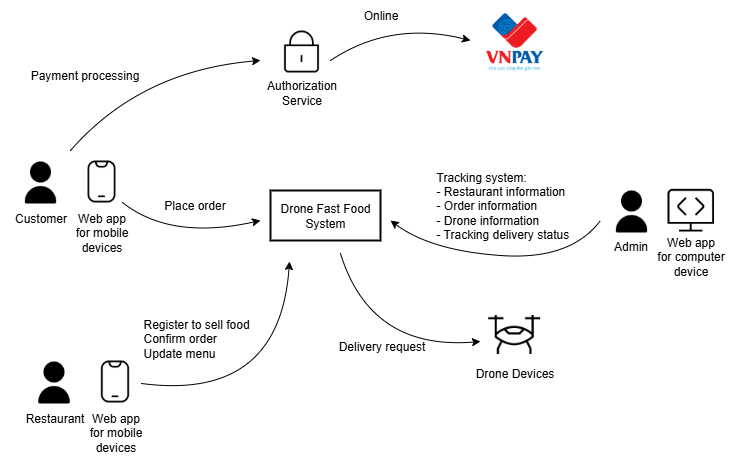
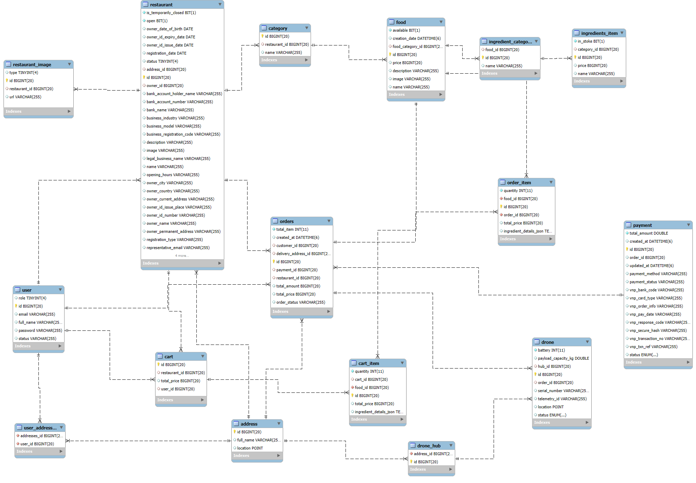
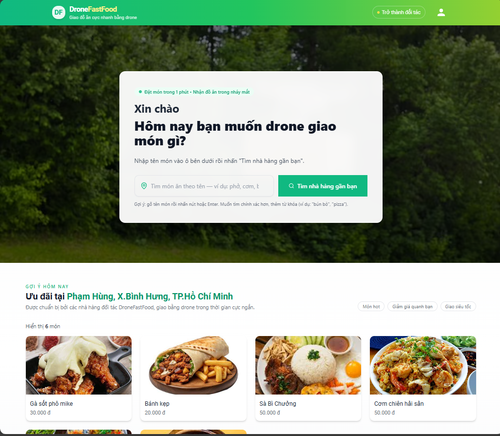
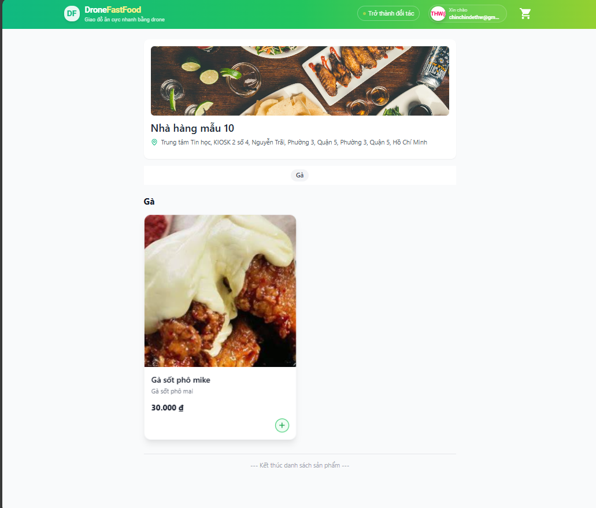
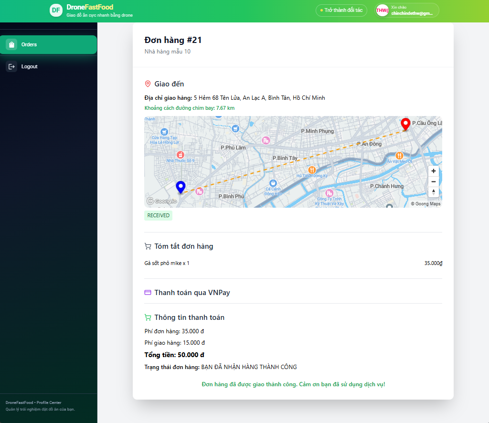
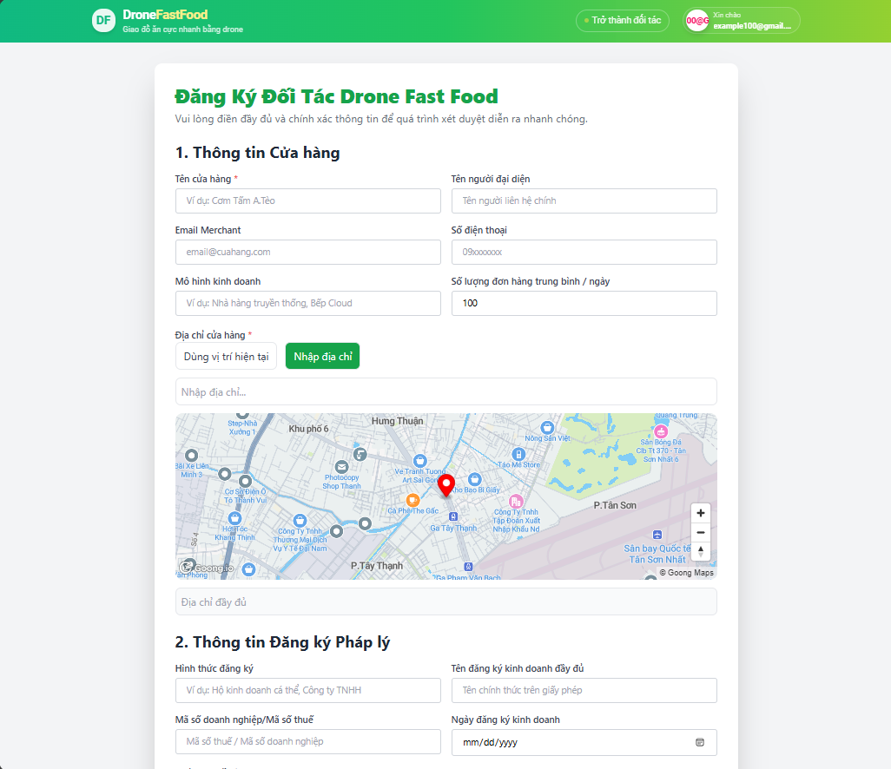
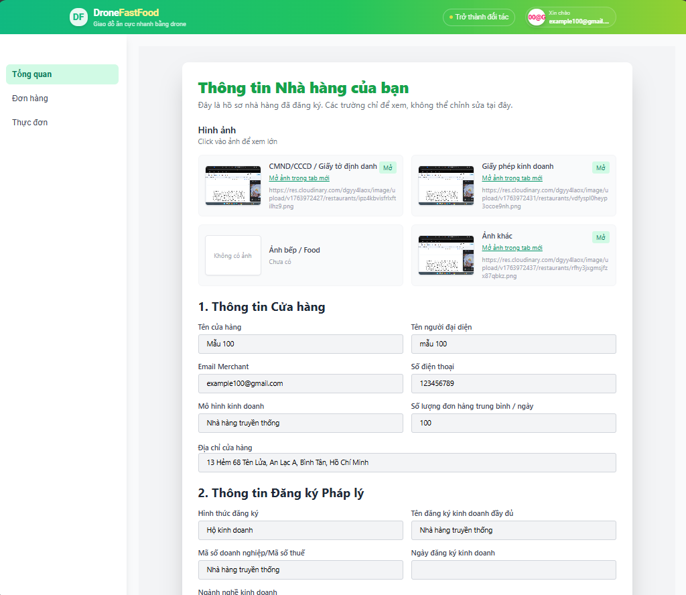
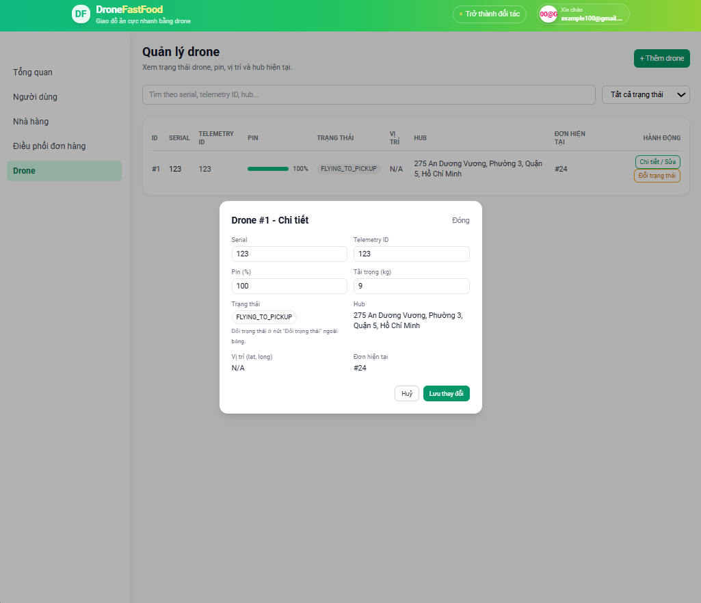

# DroneFastFood – Drone-Based Food Delivery Platform


---

## 📚 Table of Contents
1. Overview  
2. Features (Modules)  
3. Roles & Permissions  
4. System Architecture  
5. Project Structure  
6. Solution Alignment
7. ERD Diagram  
8. Technology Stack  
9. Environment Setup  
10. Run Backend  
11. Run Frontend  
12. Deployment  
13. Future Enhancements  
14. Screenshots  
15. License  

---

## 🧭 Overview
**DroneFastFood** is an automated food delivery platform powered by drones.  
It follows a **multi-vendor model** featuring Customers, Merchants, and Admins.

The system includes:
- **React Frontend** deployed on **Vercel**
- **Spring Boot Backend** hosted locally or exposed via **Cloudflare Tunnel**
- **MySQL Database**
- **Cloudinary** for image & document storage
- **Goong Map API** for geocoding & drone-route simulation
- **VNPay** for online payment

The backend is structured using **3-layer architecture** (`controller → service → repository`).

---

## 🚀 Features (Modules)

### 👤 Customer
- Register / Login (JWT)
- Browse restaurants
- View food menus per restaurant
- Restaurant-based shopping cart
- VNPay payment
- Track drone delivery in real-time

### 🧑‍🍳 Merchant
- Register restaurant (upload ID card, business license, etc.)
- Manage food items (CRUD)
- Set item status: **Available / Unavailable**
- Define custom categories and ingredients
- Confirm and update order status

### 👨‍💼 Admin
- Manage all users
- Review & verify restaurants
- Manage drones (add, update, delete if unused)
- Drone status: **Idle / Delivering / Offline / Error**
- Assign drones for orders

### 🚁 Drone Simulation (Current)
- Simulated drone flight rendered using Goong Map
- Drone marker animates along a predefined route
- On arrival → order marked **Delivered**

---

## 🔐 Roles & Permissions
| Role | Description | Permissions |
|------|-------------|-------------|
| **Customer** | End-user ordering food | Order, payment, tracking |
| **Merchant** | Restaurant owner | Menu + order management |
| **Admin** | System owner | Users, restaurants, drones |

---

## 🏗️ System Architecture
```
React Frontend (Vercel)
        │
        ▼
Spring Boot Backend (Cloudflare Tunnel)
        │
 ┌──────┴─────────┐
 ▼                ▼
MySQL         Cloudinary
        ▼
   Goong Map API
```

---

## 🧱 Project Structure
```
DroneFastFood/
├── frontend/
│   ├── src/
│   ├── public/
│   └── package.json
├── backend/
│   ├── controller/
│   ├── service/
│   ├── repository/
│   ├── entity/
│   └── DroneFastFoodApplication.java
└── database/
```
---

## Solution Alignment


---

## 🧩 ERD Diagram


### Key Relationships Summary

- User → Restaurant: A merchant user owns a restaurant.

- Restaurant → Food / Category / Ingredient: Multi-vendor menu structure.

- User → Cart → Cart Item: Customer shopping cart.

- Order → Order Item → Food: Completed purchases.

- Order → Drone: A drone can be assigned to deliver an order.

- Restaurant / User / Drone Hub → Address: All location-based entities point to address

---

## 🧰 Technology Stack
| Layer | Technology |
|-------|------------|
| Frontend | React, Redux Toolkit, Tailwind |
| Backend | Spring Boot 3, JPA, JWT |
| Database | MySQL |
| Maps | Goong Map API |
| Storage | Cloudinary |
| Payment | VNPay |
| Deployment | Vercel (FE), Cloudflare Tunnel (BE) |
| Realtime | WebSocket |

---

## ⚙️ Environment Setup

### Backend `.env`
```
DB_HOST=localhost
DB_PORT=3306
DB_NAME=dronefastfood
DB_USER=root
DB_PASSWORD=your_password

GOONG_API_KEY=your_key
CLOUDINARY_URL=your_cloudinary_url

VNPAY_TMNCODE=xxx
VNPAY_HASH_SECRET=xxx
VNPAY_RETURN_URL=https://yourfrontend.com/payment/return
```

### Frontend `.env`
```
REACT_APP_API_URL=https://your-cloudflare-public-url
REACT_APP_GOONG_MAP_KEY=your_key
REACT_APP_GOONG_MAP_TILE_KEY=your_tile_key
```

---

## ▶️ Run Backend
```
cd backend
mvn spring-boot:run
```

## ▶️ Run Frontend
```
cd frontend
npm install
npm start
```

---

## ☁️ Deployment

### Frontend – Vercel
- Connect GitHub repository  
- Vercel automatically builds & deploys  
- Set environment variables in **Project Settings → Environment Variables**

### Backend – Cloudflare Tunnel
Expose your local backend:
```
cloudflared tunnel --url http://localhost:8080
```

Use the generated public URL as the frontend API base:
```
REACT_APP_API_URL=https://xxxxxx.trycloudflare.com
```

---

## 🔁 Future Enhancements
Planned advanced drone simulation with PX4 SITL:

```
PX4 SITL → QGroundControl → MAVSDK Python → Spring Boot → Redis → WebSocket → Frontend
```

Includes:
- Realistic drone auto-flight  
- Waypoint-based navigation  
- Redis pub/sub for high-frequency tracking  
- Admin control panel for live drone telemetry  

---

## 🖼️ Screenshots

| Home | Food Detail | Drone Tracking |
|------|-------------|----------------|
|  |  |  |

| Merchant Register | Merchant Dashboard | Drone Admin |
|-------------------|--------------------|-------------|
| |  |  |

---

## 📄 License
This project is licensed under the [MIT License](LICENSE). Learn more at [choosealicense.com](https://choosealicense.com/licenses/mit/).